# Energy and value screens

Use when an opening sequence feels like a questionnaire, or when designing encouragement, evidence, reassurance or mechanism screens. Review the local images before selecting a pattern. A value screen earns its place by answering the user's current doubt or showing something useful.

## Apply the references

1. Identify the preceding answer, the unresolved doubt and the next useful action. Choose the pattern that bridges them.
2. Design one dominant visual and one typographic emphasis: highlighted phrase, oversized supported fact, human scene, illustrative comparison or product demonstration. Put the real visual into the mockup and PDF.
3. In the opening five screens, aim for one or two substantial value moments where the narrative warrants them. Vary their jobs and composition. Keep a single clear CTA on informational screens; single-answer questions advance on selection.
4. Show the actual intended screen UI. Follow the [preview numbering and progress rules](../../../preview-funnel/SKILL.md#visual-style).
5. Adapt to the client's palette, audience and mechanism. Verify text and CTA contrast, mobile fit and continuity into the next step.

Evidence selection: prefer a real product demonstration; use factual community or outcome proof only with a source and its scope/date. When proof is unavailable, use a clearly illustrative mechanism or useful answer-based example. Quantitative graphs, survey figures, ratings and testimonials in this library describe the reference only and do not substantiate another product.

Completion: the screen has a specific job, source-backed claims or clearly illustrative content, an actual embedded visual, intentional text emphasis, and a clear next action. Inspect the exported image/PDF, not only the copy.

## Provenance and limits

Captured 2026-09-11 from fourteen user-selected frames in the private reference collection “App Deals Web2web Funnels”. IDs preserve traceability without requiring Figma links or a live Figma session. Images are cropped browser captures at the observed zoom (286×576), not native editable exports; fine text may need the transcription below. Copy transcribed from the visible frames, not independently fact-checked. These are comparative design references, not licensed production assets, verified results or validated conversion experiments. Keep client production imagery original or appropriately licensed.

[Contact sheet](contact-sheet.jpg)

## 60-674 · AddMile · community collage

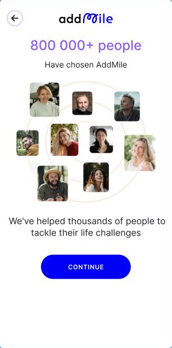

**Job:** Belonging and trust after effort.

**Composition:** Purple headline; circular orbit of portrait photos; centered copy; generous white space; solid blue pill CTA.

**Observed copy:**

> 800 000+ people
> Have chosen AddMile
> We've helped thousands of people to tackle their life challenges
> CONTINUE

**Evidence boundary:** User count and helped-thousands claim are observed reference copy, not verified evidence. Portraits are not transferable testimonials.

## 60-787 · AddMile · illustrated mechanism

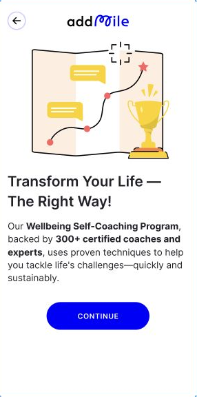

**Job:** Make an abstract program feel structured and approachable.

**Composition:** Large route-map and trophy illustration above left-aligned headline; bold phrases within a compact paragraph; one blue pill CTA.

**Observed copy:**

> Transform Your Life — The Right Way!
> Our Wellbeing Self-Coaching Program, backed by 300+ certified coaches and experts, uses proven techniques to help you tackle life's challenges—quickly and sustainably.
> CONTINUE

**Evidence boundary:** Credentials, count and effectiveness need independent evidence before reuse.

## 60-1091 · AddMile · highlighted evidence

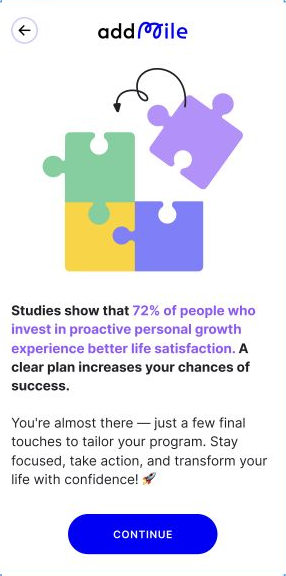

**Job:** Encouragement after questions, using a visible reason to continue.

**Composition:** Oversized colored puzzle illustration; purple inline emphasis through a bold paragraph; regular supporting paragraph; single strong CTA.

**Observed copy:**

> Studies show that 72% of people who invest in proactive personal growth experience better life satisfaction. A clear plan increases your chances of success.
> You're almost there — just a few final touches to tailor your program. Stay focused, take action, and transform your life with confidence! 🚀
> CONTINUE

**Evidence boundary:** No study citation is visible. Do not reuse 72% or infer causality. 'Almost there' must match the actual remaining journey.

## 62-4560 · BetterMe · answer-linked reassurance

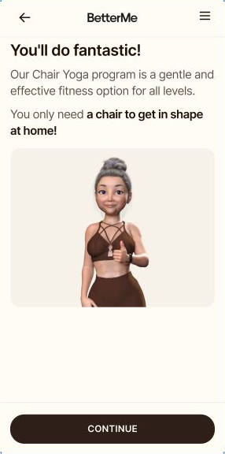

**Job:** Reduce perceived difficulty after an experience question.

**Composition:** Warm off-white surface; reassuring headline; key benefit in bold; large rounded character illustration; dark full-width bottom CTA.

**Observed copy:**

> You'll do fantastic!
> Our Chair Yoga program is a gentle and effective fitness option for all levels.
> You only need a chair to get in shape at home!
> CONTINUE

**Evidence boundary:** Exercise suitability and outcomes require product-specific support; encouragement is not a guarantee.

## 62-4687 · BetterMe · concise relevance

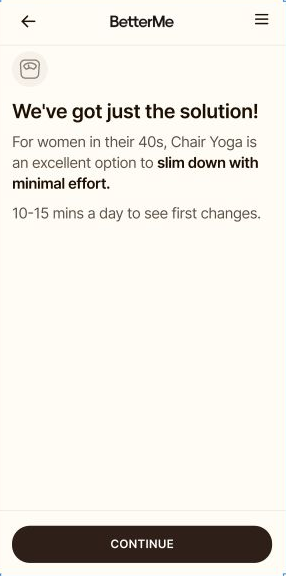

**Job:** Reflect a selected goal without another question.

**Composition:** Small contextual icon, short left-aligned headline, bold inline benefit, extensive breathing room, bottom CTA.

**Observed copy:**

> We've got just the solution!
> For women in their 40s, Chair Yoga is an excellent option to slim down with minimal effort.
> 10-15 mins a day to see first changes.
> CONTINUE

**Evidence boundary:** Minimal-effort weight loss and time-to-result claims are not verified. Borrow hierarchy, not the promise.

## 62-4961 · BetterMe · agency reassurance

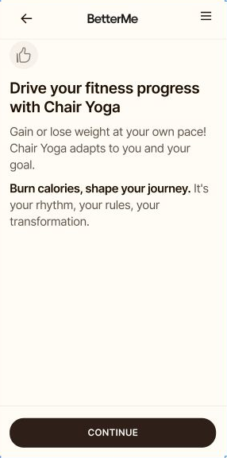

**Job:** Reassure the user that their goal influences the experience.

**Composition:** Small thumbs-up badge; compact headline; mixed regular and bold copy; warm canvas; fixed dark CTA.

**Observed copy:**

> Drive your fitness progress with Chair Yoga
> Gain or lose weight at your own pace! Chair Yoga adapts to your goal.
> Burn calories, shape your journey. It's your rhythm, your rules, your transformation.
> CONTINUE

**Evidence boundary:** Personalization must consume the actual answer; physiological outcomes are not reference-backed proof.

## 63-8587 · Promova · evidence card

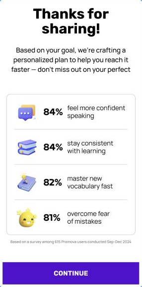

**Job:** Return reassurance after goals, with scannable evidence.

**Composition:** Heavy centered headline; four icon-and-number rows inside one white bordered card; fine-print attribution underneath; saturated purple CTA.

**Observed copy:**

> Thanks for sharing!
> Based on your goal, we're crafting a personalized plan to help you reach it faster — don't miss out on your perfect plan!
> 84% feel more confident speaking
> 84% stay consistent with learning
> 82% master new vocabulary fast
> 81% overcome fear of mistakes
> Based on a survey among 615 Promova users conducted Sep-Dec 2024
> CONTINUE

**Evidence boundary:** Observed survey attribution is n=615, Sep-Dec 2024; self-report, not measured causal improvement. Figures belong to Promova and are not verified here.

## 63-8666 · Promova · visual contrast

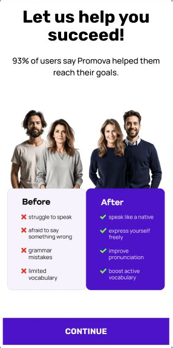

**Job:** Make the desired change easy to picture.

**Composition:** Two groups of people above overlapping Before/After cards; pale problem panel versus saturated purple aspiration panel; concise bullets; wide CTA.

**Observed copy:**

> Let us help you succeed!
> 93% of users say Promova helped them reach their goals.
> Before
> struggle to speak
> afraid to say something wrong
> grammar mistakes
> limited vocabulary
> After
> speak like a native
> express yourself freely
> improve pronunciation
> boost active vocabulary
> CONTINUE

**Evidence boundary:** 93% and native-like results are unverified; posed people are not evidence of a real before/after. Use illustrative contrasts with no invented outcomes.

## 63-8726 · Promova · hero plus comparison

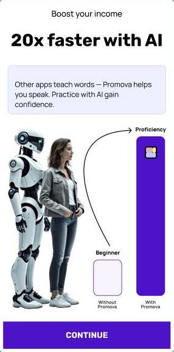

**Job:** Explain a perceived mechanism through a strong visual contrast.

**Composition:** Large bold claim; tinted explanation box; human-and-robot cutout beside two radically different bars and an upward arrow; purple CTA.

**Observed copy:**

> Boost your income
> 20x faster with AI
> Other apps teach words — Promova helps you speak. Practice with AI gain confidence.
> Proficiency
> Beginner
> Without Promova
> With Promova
> CONTINUE

**Evidence boundary:** 20x, income, comparison bars and generalization about other apps lack visible substantiation. Do not transfer them or invent a quantitative graph.

## 63-8790 · Promova · human reassurance

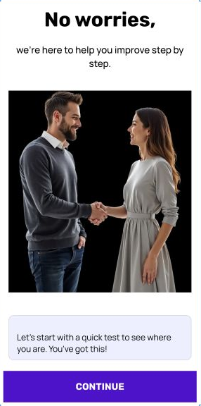

**Job:** Lower anxiety before a test and explain the next action.

**Composition:** Very short bold headline; large photo of two people interacting; separate pale-purple encouragement card; purple bottom CTA.

**Observed copy:**

> No worries,
> we're here to help you improve step by step.
> Let's start with a quick test to see where you are. You've got this!
> CONTINUE

**Evidence boundary:** Match the next action to a real test; do not imply a depicted person is a customer or teacher without evidence.

## 63-8912 · Promova · milestone and belonging

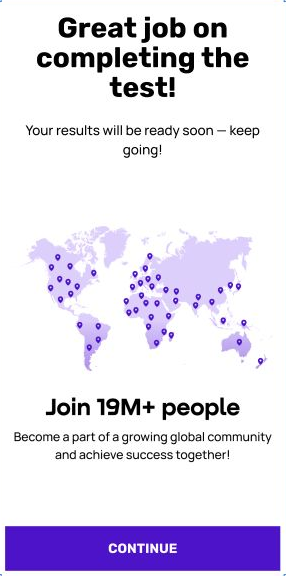

**Job:** Acknowledge completed effort and provide a sense of belonging.

**Composition:** Celebratory centered heading; large world-map illustration with pins; large community count below; anchored purple CTA.

**Observed copy:**

> Great job on completing the test!
> Your results will be ready soon — keep going!
> Join 19M+ people
> Become a part of a growing global community and achieve success together!
> CONTINUE

**Evidence boundary:** 19M+ is observed brand copy, not verified here. Only acknowledge a test actually completed; avoid fake results-loading claims.

## 63-11545 · Keiki · lifestyle fit

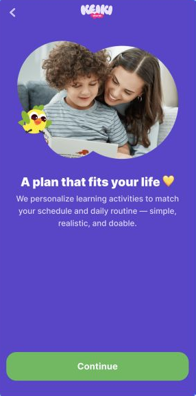

**Job:** Translate a schedule answer into feasibility and warmth.

**Composition:** Full purple background; organic rounded photo of parent and child, small mascot overlapping the image; centered white heading; key phrases emphasized; green wide CTA.

**Observed copy:**

> A plan that fits your life 💛
> We personalize learning activities to match your schedule and daily routine — simple, realistic, and doable.
> Continue

**Evidence boundary:** Only claim personalization that the flow delivers. Photo is illustrative, not a customer testimonial. Recheck contrast in a new palette.

## 63-11586 · Keiki · normalize then explain

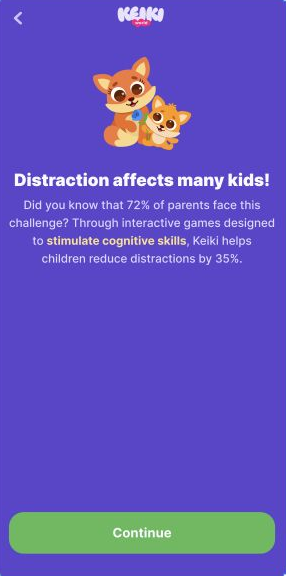

**Job:** Normalize a concern, then connect it to a product mechanism.

**Composition:** Purple canvas; paired mascots; bold white headline; highlighted mechanism in a short centered paragraph; green bottom CTA.

**Observed copy:**

> Distraction affects many kids!
> Did you know that 72% of parents face this challenge? Through interactive games designed to stimulate cognitive skills, Keiki helps children reduce distractions by 35%.
> Continue

**Evidence boundary:** 72% and 35% have no visible supporting study; do not copy child-development efficacy claims.

## 57-432 · Headway · illustrated welcome

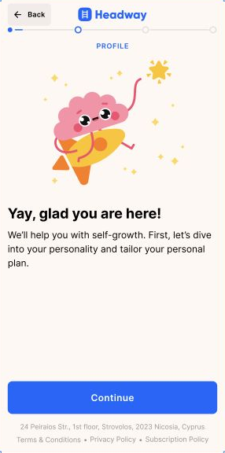

**Job:** Create warmth and explain the purpose of the next questions.

**Composition:** Warm pale background; large celebratory brain mascot; bold left-aligned welcome; short explanation; blue full-width CTA; restrained actual progress header.

**Observed copy:**

> PROFILE
> Yay, glad you are here!
> We'll help you with self-growth. First, let's dive into your personality and tailor your personal plan.
> Continue

**Evidence boundary:** Personalization must correspond to actual answer use; adapt the illustration rather than copying another brand mascot.
